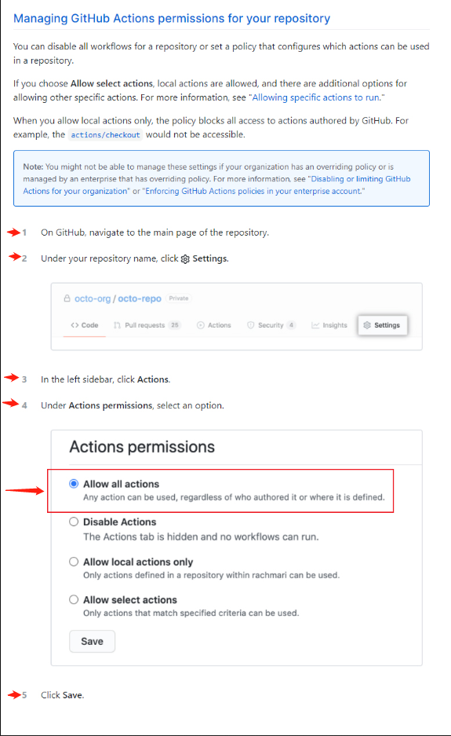
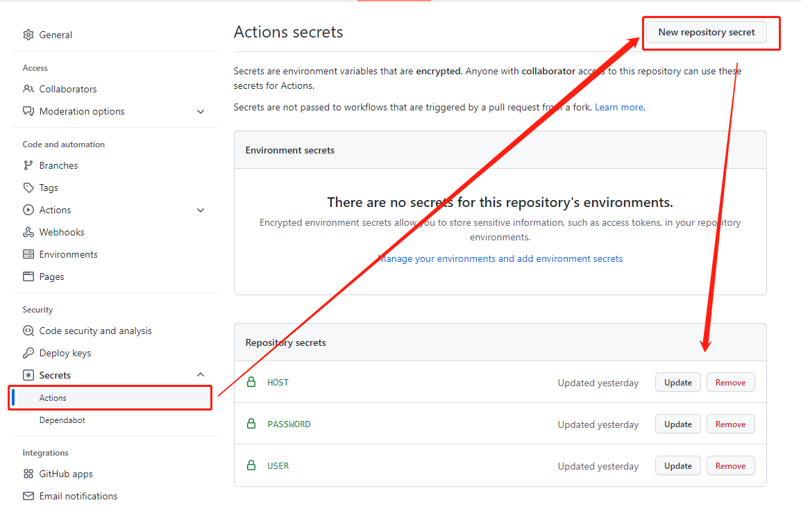

# Github Actions Rss (已收集{{rss_num}}个RSS源, 生成时间: {{ga_rss_datetime}})

信息茧房是指人们关注的信息领域会习惯性地被自己的兴趣所引导，从而将自己的生活桎梏于像蚕茧一般的“茧房”中的现象。

## 打破信息茧房
项目会利用免费的Github Actions服务, 提供一个内容全面的信息流, 让现代人的知识体系更广泛, 减弱信息茧房对现代人的影响, 让**非茧房信息流**造福人类~

## 主要功能
1. 收集RSS, 打造无广告内容优质的 **头版头条** 超赞新闻页
2. 利用Github Actions, 搜集全部RSS的头版头条新闻标题和超链接, 并自动更新到首页,当天最新发布的文章会出现🌈 标志

邮件内容区开始>
<h2>新蒸熟{{new_num}}个小蛋糕🍰(文章) 生产时间 {{ga_rss_datetime}} 保质期24小时</h2>

{{news}}

<邮件内容区结束

## 已收集RSS列表

| 编号 | 名称 | 描述 | RSS  |  最新内容 |
| --- | --- | --- | --- |  --- |
| <h2 id="软件工具">软件工具</h2> |  |   |  |
| S001|  不死鸟 | 不死鸟:专注分享优质资源 | {{latest_content}} |  [订阅地址](https://iao.su/feed) | 
| S002| 精品MAC应用分享 | 精品MAC应用分享，每天分享大量mac软件，为您提供优质的mac软件,免费软件下载服务 |  {{latest_content}} | [订阅地址](https://xclient.info/feed) | 
| S003| 老殁 | 免费推荐优秀软件 |  {{latest_content}} | [订阅地址](https://www.mpyit.com/feed) |
| S004| 鹏少资源网 | 专注于精品软件收录分享 |   {{latest_content}} | [订阅地址](https://www.jokerps.com/feed) |
| S005| 小众软件 | 分享免费、小巧、实用、有趣、绿色的软件 | {{latest_content}} | [订阅地址](https://www.appinn.com/feed/) | 
| S006| 懒得勤快的博客 | 懒得勤快，互联网分享精神，勤于发现，乐于分享 |  {{latest_content}} | [订阅地址](https://masuit.com/rss) |


## 批量导入所有RSS订阅

OPML V2.0:  https://raw.githubusercontent.com/lxlfpeng/RssMaker/main/subscription_list_v2.opml
OPML V1.0:  https://raw.githubusercontent.com/lxlfpeng/RssMaker/main/subscription_list_v1.opml

> 如果RSS软件版本较老无法识别以上订阅,请使用V1.0版本的OPML订阅信息。

## 如何定制自己的私人简报?
### 1.将项目上传到Github仓库中

### 2.允许运行actions

### 3.增加删除订阅源
在EditREADME.md中, 展示了已收集的RSS列表, 你可以参考每行的格式, 按行增删自己订阅的RSS。

### 4.邮件发送
##### 邮件发送人设置

- 配置邮件服务器。
- 配置负责发邮件的邮箱密码。
- 配置负责发邮件的邮箱名。

##### 邮件接收人设置
在根目录, tasks.json中配置收件人, 收件人是一个对象数组, 数组中的邮箱, 都会收到邮件。
```
{
    "tasks": [
        {
            "email": "lxlfpeng@163.com"
        },
        {
            "email": "lxlfpeng@163.com"
        }
    ]
}
```
设置完成后 在README.md文件的底部加个空格，并push，即可触发更新！

