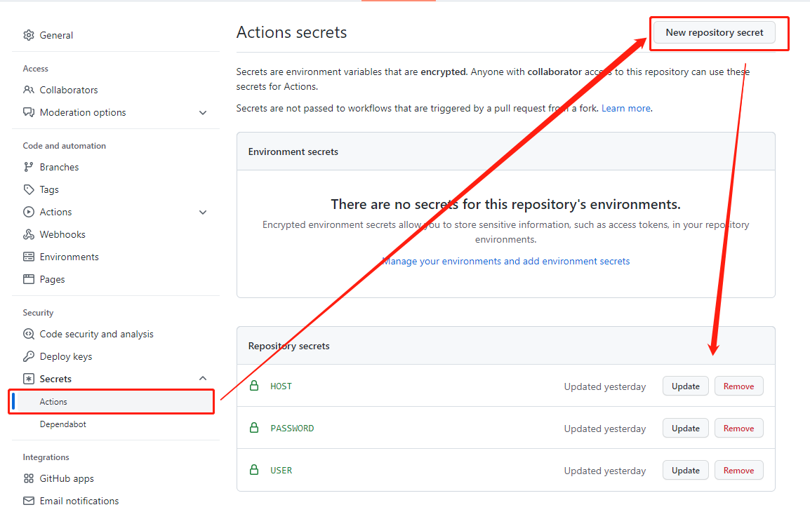

# Github Actions Rss (已收集6个RSS源, 生成时间: 2022-04-24 18:16:52)

信息茧房是指人们关注的信息领域会习惯性地被自己的兴趣所引导，从而将自己的生活桎梏于像蚕茧一般的“茧房”中的现象。

## 打破信息茧房
项目会利用免费的Github Actions服务, 提供一个内容全面的信息流, 让现代人的知识体系更广泛, 减弱信息茧房对现代人的影响, 让**非茧房信息流**造福人类~

## 主要功能
1. 收集RSS, 打造无广告内容优质的 **头版头条** 超赞新闻页
2. 利用Github Actions, 搜集全部RSS的头版头条新闻标题和超链接, 并自动更新到首页,当天最新发布的文章会出现🌈 标志

邮件内容区开始>
<h2>新蒸熟11个小蛋糕🍰(文章) 生产时间 2022-04-24 18:16:52 保质期24小时</h2>

<div style='line-height:3;background-color:#FAF6EA;' ><a href='https://iao.su/3821/' style="line-height:2;text-decoration:none;display:block;color:#584D49;">🌈 ‣ A0KE莆田潮牌专供「主打中高端品质」 | 第1篇</a></div><div style='line-height:3;' ><a href='https://www.mpyit.com/litiaotiaoapk.html' style="line-height:2;text-decoration:none;display:block;color:#584D49;">🌈 ‣ 李跳跳 派大星2.0 自动跳过APP启动广告 | 第2篇</a></div><div style='line-height:3;background-color:#FAF6EA;' ><a href='https://www.mpyit.com/uninstalltool.html' style="line-height:2;text-decoration:none;display:block;color:#584D49;">🌈 ‣ Uninstall Tool 3.6.0.5684 专业卸载工具 | 第3篇</a></div><div style='line-height:3;' ><a href='https://www.mpyit.com/startallback.html' style="line-height:2;text-decoration:none;display:block;color:#584D49;">🌈 ‣ StartAllBack 3.3.5.4345 Windows11开始菜单 | 第4篇</a></div><div style='line-height:3;background-color:#FAF6EA;' ><a href='https://www.appinn.com/qingsong-wupinguanli/' style="line-height:2;text-decoration:none;display:block;color:#584D49;">🌈 ‣ 轻松物品管理 – 支持 Spotlight 的收纳应用，记住不常用物品的位置[iPhone] | 第5篇</a></div><div style='line-height:3;' ><a href='https://www.appinn.com/listary-6/' style="line-height:2;text-decoration:none;display:block;color:#584D49;">🌈 ‣ Listary 6 时隔 3 年正式发布，老用户可免费升级 | 第6篇</a></div><div style='line-height:3;background-color:#FAF6EA;' ><a href='https://masuit.com/84' style="line-height:2;text-decoration:none;display:block;color:#584D49;">🌈 ‣ 卸载利器——Uninstall Tool v3.6.0.5684 学习版 | 第7篇</a></div><div style='line-height:3;' ><a href='https://masuit.com/1751' style="line-height:2;text-decoration:none;display:block;color:#584D49;">🌈 ‣ StartAllBack(StartIsBack++) v3.3.5.4345直装版 | 第8篇</a></div><div style='line-height:3;background-color:#FAF6EA;' ><a href='https://masuit.com/2140' style="line-height:2;text-decoration:none;display:block;color:#584D49;">🌈 ‣ 功能强大的资源管理器——Directory Opus Pro 12.23.7655 x64多语言学习版 | 第9篇</a></div><div style='line-height:3;' ><a href='https://masuit.com/1459' style="line-height:2;text-decoration:none;display:block;color:#584D49;">🌈 ‣ Process Lasso 10.4.7.7/ParkControl Pro 2.2.0.6 简体中文学习版 | 第10篇</a></div><div style='line-height:3;background-color:#FAF6EA;' ><a href='https://masuit.com/p172' style="line-height:2;text-decoration:none;display:block;color:#584D49;">🌈 ‣ 畅游云，高性价比的国际网络加速服务，低至9.9元/100GB | 第11篇</a></div>

<邮件内容区结束

## 已收集RSS列表

| 编号 | 名称 | 描述 | RSS  |  最新内容 |
| --- | --- | --- | --- |  --- |
| <h2 id="软件工具">软件工具</h2> |  |   |  |
| S001|  不死鸟 | 不死鸟:专注分享优质资源 | [‣ 2022 年 4 月每日分享 \| 2022-04-23](https://iao.su/154/)<br/>[‣ 网页在线工具汇总 \| 2022-04-23](https://iao.su/1492/) |  [订阅地址](https://iao.su/feed) | 
| S002| 精品MAC应用分享 | 精品MAC应用分享，每天分享大量mac软件，为您提供优质的mac软件,免费软件下载服务 |  [‣ Integrity Pro 12.3.2 网站死链清理优化检测器 \| 2022-04-22](https://xclient.info/s/integrity-pro.html)<br/>[‣ Wondershare UniConverter 13.6.2.1 视频编辑转换工具 \| 2022-04-22](https://xclient.info/s/wondershare-uniconverter.html) | [订阅地址](https://xclient.info/feed) | 
| S003| 老殁 | 免费推荐优秀软件 |  [‣ 李跳跳 派大星2.0 自动跳过APP启动广告 🌈 2022-04-24](https://www.mpyit.com/litiaotiaoapk.html)<br/>[‣ Uninstall Tool 3.6.0.5684 专业卸载工具 🌈 2022-04-24](https://www.mpyit.com/uninstalltool.html) | [订阅地址](https://www.mpyit.com/feed) |
| S004| 鹏少资源网 | 专注于精品软件收录分享 |   [‣ 7-Zip \| 2021-08-08](https://www.jokerps.com/6187.html)<br/>[‣ GIMP \| 2021-08-08](https://www.jokerps.com/6181.html) | [订阅地址](https://www.jokerps.com/feed) |
| S005| 小众软件 | 分享免费、小巧、实用、有趣、绿色的软件 | [‣ 轻松物品管理 – 支持 Spotlight 的收纳应用，记住不常用物品的位置\[iPhone\] 🌈 2022-04-24](https://www.appinn.com/qingsong-wupinguanli/)<br/>[‣ Listary 6 时隔 3 年正式发布，老用户可免费升级 🌈 2022-04-24](https://www.appinn.com/listary-6/) | [订阅地址](https://www.appinn.com/feed/) | 
| S006| 懒得勤快的博客 | 懒得勤快，互联网分享精神，勤于发现，乐于分享 |  [‣ 卸载利器——Uninstall Tool v3.6.0.5684 学习版 🌈 2022-04-24](https://masuit.com/84)<br/>[‣ StartAllBack(StartIsBack++) v3.3.5.4345直装版 🌈 2022-04-24](https://masuit.com/1751) | [订阅地址](https://masuit.com/rss) |


## 批量导入所有RSS订阅

OPML V2.0:  https://raw.githubusercontent.com/lxlfpeng/RssMaker/main/subscription_list_v2.opml
OPML V1.0:  https://raw.githubusercontent.com/lxlfpeng/RssMaker/main/subscription_list_v1.opml

> 如果RSS软件版本较老无法识别以上订阅,请使用V1.0版本的OPML订阅信息。

## 如何定制自己的私人简报?
### 1.将项目上传到Github仓库中

### 2.允许运行actions

### 3.增加删除订阅源
在EditREADME.md中, 展示了已收集的RSS列表, 你可以参考每行的格式, 按行增删自己订阅的RSS。

### 4.邮件发送
##### 邮件发送人设置

- 配置邮件服务器。
- 配置负责发邮件的邮箱密码。
- 配置负责发邮件的邮箱名。

##### 邮件接收人设置
在根目录, tasks.json中配置收件人, 收件人是一个对象数组, 数组中的邮箱, 都会收到邮件。
```
{
    "tasks": [
        {
            "email": "lxlfpeng@163.com"
        },
        {
            "email": "lxlfpeng@163.com"
        }
    ]
}
```
设置完成后 在README.md文件的底部加个空格，并push，即可触发更新！

